# animdiagram

Looping animated SVG explainer diagrams as an [Agent Skill](https://skills.sh) — the "packets flowing between boxes" style of SpacetimeDB's *How does Spacetime scale* series, with the editorial discipline of [diagram-design](https://github.com/cathrynlavery/diagram-design).

**Gallery:** [praveenvijayan.github.io/animdiagram](https://praveenvijayan.github.io/animdiagram/) — reference architectures redrawn as looping explainers.



<details><summary>Same diagram, light skin (one command)</summary>



</details>

- **One `.svg`, one `<style>`, CSS `@keyframes` only.** No script, no SMIL, no fonts to load, no build. Drops into ``, Markdown, Substack, GitHub READMEs.
- **Motion grammar**: packets on one shared story clock, arrival rings, destination glows, idle ticks, ambient streams, phase captions, growing bars, movers, state swaps.
- **Design discipline**: deletion first, one accent colour, ≤ 9 nodes, 4px grid, orthogonal connectors, the static frame must read on its own (reduced-motion safe).
- **Tooling**: `timeline.py` compiles a small JSON event list into keyframes; `check.py` verifies the file; `preview.py` gives you a scrubber to tune timing by eye.

## Install

```bash
npx skills add praveenvijayan/animdiagram
```

Works with Claude Code, Codex, Cursor, Gemini CLI, Copilot and every other agent [skills.sh](https://skills.sh) supports. Manual alternative:

```bash
git clone https://github.com/praveenvijayan/animdiagram ~/.claude/skills/animdiagram
```

Claude Code plugin marketplace also works (`/plugin marketplace add praveenvijayan/animdiagram`).

## Use

Ask your agent for an *animated* or *looping* diagram and describe the story:

> animated diagram: a client posts a job, the API enqueues it and answers 202 at once, a worker later writes to the database and gets an ack; 8 s loop

The skill writes the brief (cast + ordered events), draws the static frame, compiles the motion, verifies, and hands you a `.svg`.

Hand-driven loop:

```bash
cp assets/template.svg diagrams/my-story.svg        # draw the static frame
$EDITOR diagrams/my-story.spec.json                 # list events: from → to, after, glow…
python3 scripts/timeline.py diagrams/my-story.spec.json --inject diagrams/my-story.svg
python3 scripts/check.py diagrams/my-story.svg
python3 scripts/preview.py diagrams/my-story.svg --open   # scrub, tune, repeat
python3 scripts/skin.py diagrams/my-story.svg --to light  # optional light variant
```

Python 3.10+, no dependencies.

## Layout

```
SKILL.md                     entry point: when, philosophy, workflow, budgets
references/
  style-guide.md             tokens (dark default, light opt-in), type ramp, node treatments, chrome
  layout.md                  grid, connectors, nodes, zones, legend, anti-patterns
  motion-grammar.md          primitives, timing math, composition rules, reduced motion, budgets
  storyboard.md              brief format and the spec.json schema for timeline.py
  checklist.md               pre-ship taste gate
scripts/
  timeline.py                spec.json → @keyframes + packet/ring/glow/phase elements, injected between markers
  check.py                   verifier: XML, root attrs, forbidden content, keyframe ↔ reference, budgets, grid
  preview.py                 HTML wrapper with a timeline scrubber, light/dark bg, 2×
  skin.py                    derive the light (or dark) variant of a finished diagram
  test_timeline.py           smoke tests (python3 scripts/test_timeline.py)
assets/
  template.svg               dark skeleton with motion markers
  template-light.svg         light skeleton
  example-async-jobs.svg     worked example (+ .spec.json, + -light.svg via skin.py)
```

## Spec at a glance

```json
{ "loop": 8, "events": [
  { "id": "m1", "kind": "packet", "at": 0.2, "travel": 0.5, "from": [44,148], "to": [96,148],
    "glow": { "x": 96, "y": 120, "w": 112, "h": 56 } },
  { "id": "m2", "kind": "packet", "after": "m1", "from": [208,148], "to": [248,148] },
  { "id": "ph1", "kind": "phase", "at": 0, "until": 2.9, "text": "1 · ACCEPT", "x": 632, "y": 96 },
  { "id": "s1", "kind": "stream", "from": [512,148], "to": [552,148], "period": 1.2, "count": 3, "color": "#02BEFA" }
] }
```

Kinds: `packet` (with `via` waypoints, `label`, `ring`, `glow`), `stream`, `phase`, `show`, `pulse`, `bar`, `move`. Timing by `at`, `after` (+`gap`) or `with`. Full schema in [references/storyboard.md](references/storyboard.md).

## If your agent already routes diagrams elsewhere

Static figures belong to a static-diagram skill (diagram-design, archify…). This skill is for the case where motion *is* the explanation. If a global rule sends every "diagram" request to one skill, add one line: *animated / looping / explainer SVG → animdiagram*.

## Credits

- **[diagram-design](https://github.com/cathrynlavery/diagram-design)** by Cathryn Lavery (MIT): the connector rules, complexity budget, 4px grid and "deletion first" philosophy are adapted from it. No code copied.
- **[SpacetimeDB](https://spacetimedb.com/blog)** *How does Spacetime scale* series: the visual and motion style (dark frame, mono caps, packet / ring / glow choreography) is studied from those figures. Their SVGs are not included here.

## License

MIT — see [LICENSE](LICENSE).
